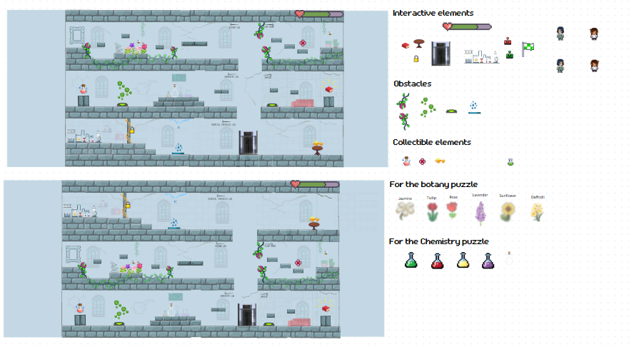
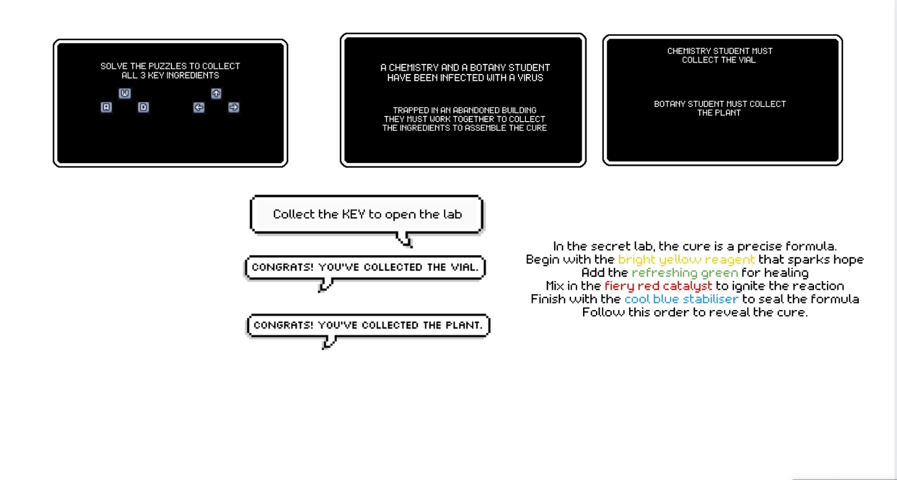
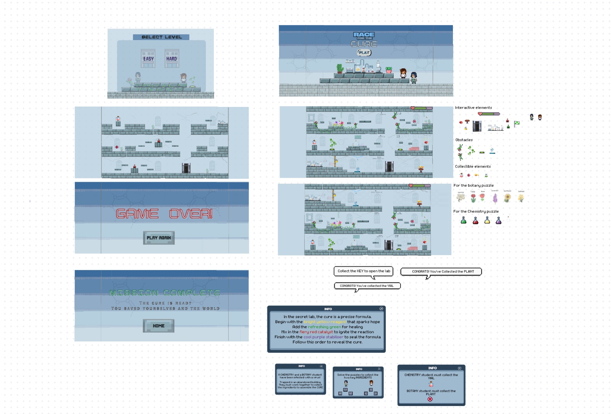

## Week 10 – Final Level Design & Game Flow

During this week, we came up with two final level layout ideas for the game. 

### First Design Idea:
The initial concept placed the **key** and **main lab** on the **ground floor**.  
The intended flow was:
1. Collect the key.
2. Go up to the **first floor** to solve the **chemistry puzzle**.
3. Continue to the **second floor** for the **botany puzzle**.
4. Then go *all the way back down* to the lab to create the cure.

While this approach made sense initially, we later found it:
- Time-consuming  
- Less engaging for players  
- Repetitive in terms of movement

---

### ✅ Final Design Choice:
We decided to **reverse** the puzzle flow for better logic and engagement.  

The final layout:
1. Start by solving the **chemistry puzzle** on the ground floor
2. Move up to the **first floor** for the **botany puzzle**
3. Finish on the **second floor**, where you collect the **key**
4. Go to the lab (also on the second floor) and **save your life**

This progression felt smoother and more rewarding for players.

---

### Clear Instructions & Info Screens
We also created **instructional panels** to help players understand:
- The game objective before starting
- What to do during gameplay

These instructions guide the player through each puzzle and step clearly.

---

### Final Game Screens

We completed the visual design for key game pages, including:

- **Homepage (Title Screen)**
- **Menu (Level Selection: Easy/Hard)**
- **In-game UI & levels**
- **Game Over screen**
- **Victory screen (Mission Complete)**

These elements represent the final version of our visual and interaction design!

---

