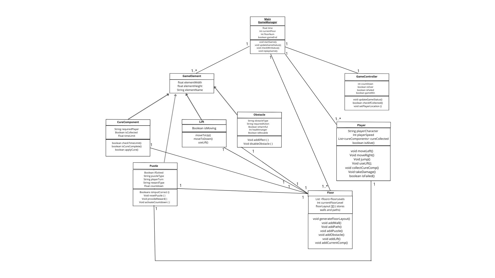

# 2025-group-9
2025 COMSM0166 group 9

## Your Game

Link to your game [PLAY HERE](https://peteinfo.github.io/COMSM0166-project-template/)

Your game lives in the [/docs](https://github.com/UoB-COMSM0166/2025-group-9/tree/main/docs) folder, and is published using Github pages to the link above.

Include a demo video of your game here (you don't have to wait until the end, you can insert a work in progress video)

## Table of Contents
- [The Group](#the-group)
- [Introduction](#introduction)
- [Requirements](#requirements)
- [Design](#design)
- [Implementation](#implementation)
- [Evaluation](#evaluation)
- [Process](#process)
- [Conclusion](#conclusion)
- [Contribution Statement](#contribution-statement)

## The Group

 

| Name                        | Email                  |        Username |
|-----------------------------|------------------------|-----------------|
| Vera Babasa                 | ho24168@bristol.ac.uk  | VeraB08         |
| Satvika Mallela             | jg24071@bristol.ac.uk  | satvikamal      |
| Abdul-Hakeem Lamptey        | qw19275@bristol.ac.uk  | ahl-hx          |
| Maram Abdulaziz Alhussain   | ho24644@bristol.ac.uk  | MaramAbdulaziz1 |
| Hadeel Ibrahim              | po24432@bristol.ac.uk  | hadeelibrahimn  |

## Introduction

When designing our game, we set out to create a puzzle-platformer that encourages players to work together under increasing time pressure. Inspired by Fireboy and Watergirl, we wanted to develop a game where each character has distinct roles and obstacles to overcome, meaning coordination is key. The twist we introduced was a multi-floor maze with a lift system, combined with puzzles that only appear when collecting key ingredients and a progressive difficulty system where movement slows as the virus takes hold.

Players take on the roles of two university students, a chemistry student and a biology student, who accidentally infected themselves with a virus from an experiment they conducted together. Trapped in an abandoned science building at the University of Bristol, they need to find and collect four key ingredients to create a cure. However, only specific characters can retrieve certain ingredients, so teamwork is essential.

The science building is split into different levels, each with character-specific obstacles and puzzles that must be solved to access an ingredient. Players navigate the maze together, using the lift system to move between floors, while battling the effects of the virus, which slows their movement over time. Once all four ingredients are collected, the timer speeds up, forcing players to race to the lab before the time runs out.

Inorder to win, both players must survive, collect all four ingredients and get to the lab before the time runs out. If one player dies, the game will restart.

## Requirements 

- 15% ~750 words
- Use case diagrams, user stories. Early stages design. Ideation process. How did you decide as a team what to develop? 

## Design

### Figure 1  
*Class diagram illustrating the game structure.*  

- 15% ~750 words 
- System architecture. Class diagrams, behavioural diagrams. 

## Implementation

- 15% ~750 words

- Describe implementation of your game, in particular highlighting the three areas of challenge in developing your game. 

## Evaluation

- 15% ~750 words

- One qualitative evaluation (your choice) 

- One quantitative evaluation (of your choice) 

- Description of how code was tested. 

## Process 

- 15% ~750 words

- Teamwork. How did you work together, what tools did you use. Did you have team roles? Reflection on how you worked together. 

## Conclusion

- 10% ~500 words

- Reflect on project as a whole. Lessons learned. Reflect on challenges. Future work. 

## Contribution Statement

- Provide a table of everyone's contribution, which may be used to weight individual grades. We expect that the contribution will be split evenly across team-members in most cases. Let us know as soon as possible if there are any issues with teamwork as soon as they are apparent. 

## Additional Marks

You can delete this section in your own repo, it's just here for information. in addition to the marks above, we will be marking you on the following two points:

- **Quality** of report writing, presentation, use of figures and visual material (5%) 
  - Please write in a clear concise manner suitable for an interested layperson. Write as if this repo was publicly available.

- **Documentation** of code (5%)

  - Is your repo clearly organised? 
  - Is code well commented throughout?
